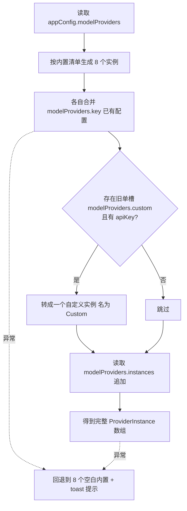
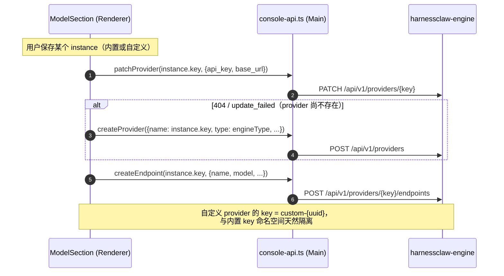

# Provider 动态化改造设计方案

> 视角：把 Settings → 模型 页面写死的「8 内置 + 1 隐藏 custom」固定 Provider 结构，改造成「内置厂商 + 用户自定义」两段式的动态列表，让用户可以新增任意数量的 Provider。
>
> 涉及的源码层：`renderer` (Settings / WelcomeModal UI + providers.ts 数据层) → `preload` (Context Bridge) → `main` (console-api.ts 转发引擎 REST) → `harnessclaw-engine` (Providers Management API)。
>
> 状态：设计稿，待评审后实施。

---

## 1. 背景与问题

HarnessClaw 当前的 Provider 体系在渲染端是**写死的固定结构**，与引擎的动态能力不匹配。

| 层 | 现状 | 能力 |
|---|---|---|
| 渲染端 | `ManagedProviderKey` 是一个闭合的 9 元联合类型（8 内置 + `custom`），全局以 `Record<ManagedProviderKey, ProviderConfig>` 组织 | 固定 8 个内置厂商；`custom` 单槽且在设置页被过滤隐藏 |
| 引擎端 | 两级模型 `providers`（凭证）→ `endpoints`（模型绑定），`POST /providers` 支持创建任意 name 的 provider，`type ∈ {openai, anthropic, gemini}` | 动态、无数量上限 |

**核心矛盾**：引擎本身支持动态创建任意多个 Provider，但客户端把它锁死成 8+1 个固定槽。

**用户痛点**：

- 想配第二个 OpenAI 代理 / 自建网关 / 任意未内置的 OpenAI 兼容厂商 —— 无处可加。
- `custom` 只有一个槽位，且在 Settings → 模型 的左侧栏被直接过滤掉（`SettingsPage.tsx` `if (key === 'custom') return false`），实际只能在首启 WelcomeModal 配一个。

### 1.1 关键代码位置（现状）

| 关注点 | 文件 | 说明 |
|---|---|---|
| 枚举与常量表（3 张） | `src/renderer/src/lib/providers.ts` | `ManagedProviderKey` / `PROVIDER_DISPLAY_NAMES` / `PROVIDER_DEFAULT_BASES` / `PROVIDER_ENGINE_TYPES` |
| 常量表（另 5 张） | `src/renderer/src/components/pages/SettingsPage.tsx` | `PROVIDER_LOGO_BG` / `PROVIDER_TO_BRAND` / `PROVIDER_APIKEY_PAGES` / `PROVIDER_DOCS_PAGES` / `PROVIDER_MODELS_PAGES`，全部是 `Record<ManagedProviderKey, ...>`，必须为 9 个 key 提供值 |
| 列表渲染 | `src/renderer/src/components/pages/SettingsPage.tsx`（ModelSection） | `MANAGED_PROVIDER_KEYS.filter(...).map(...)` 渲染固定 8 项 |
| 读取合并 | 同上 `getManagedProviders` | 合并 `engineConfig.providers` + `engineConfig.llm.providers` + `appConfig.modelProviders` 三源 |
| 引擎双写 | 同上 `schedulePatchProviderCredentials` / `ensureProviderExists` / `hotCreateEndpoint` 等 | 调 `console-api.ts` 转发到引擎 REST |
| 首启配置 | `src/renderer/src/components/WelcomeModal.tsx` | `buildWelcomeProviders` |

> **共 8 张按 `ManagedProviderKey` 索引的常量表**（providers.ts 3 张 + SettingsPage 5 张）。改造的核心工作之一就是把它们从「编译期枚举映射」收敛成「按模板 key 查表 + 实例字段」——见 §3.3。

> 注意：现有代码里另有一个无关的 `group` 概念 —— `ProviderModelEntry.group` / `MODEL_FAMILY_RULES`，指的是 **provider 内部的模型族分组**（把 Claude / GPT-4 归类展示）。本方案的「Provider group」是 **provider 列表层面的分组**，两者命名相近但语义不同，实施时不要混淆。

---

## 2. 改造目标

### 2.1 最终形态

Settings → 模型 页面左侧栏从「8 个固定项」变为「**内置厂商 + 自定义**两段式动态列表」：

```
┌─ 模型设置 ──────────────────────────────────┐
│ [搜索框]                                      │
│                                              │
│ 内置厂商 ───────────────                      │
│   🔷 科大讯飞 Spark              [复制]       │
│   🔶 Anthropic            ON     [复制]       │
│   🟢 OpenAI                      [复制]       │
│   … (共 8 个，可编辑 / 可禁用 / 不可删)        │
│                                              │
│ 自定义 ─────────────────                      │
│   AB 公司内网 OpenAI     ON  [复制][删除]    │
│   CD 备用 Claude 代理        [复制][删除]    │
│                                              │
│ ┌──────────────────────────────────────┐    │
│ │        + 添加 Provider                │    │
│ └──────────────────────────────────────┘    │
└──────────────────────────────────────────────┘
```

### 2.2 三类操作权限

| 操作 | 内置厂商 | 自定义 |
|---|---|---|
| 编辑配置（Key / 地址 / 模型） | ✅ | ✅ |
| 启用 / 禁用 | ✅ | ✅ |
| 复制（派生一个自定义副本） | ✅ | ✅ |
| 删除 | ❌ 不可删 | ✅ |

### 2.3 添加 / 复制交互

- **添加**：点底部「+ 添加 Provider」→ 弹对话框，填 4 项（名称、协议 `OpenAI / Anthropic / Gemini`、API 地址、API Key）→ 确认后出现在「自定义」分组。
- **复制**：点任意 Provider 的「复制」→ 自动带出源的协议与地址，生成名为「XXX Copy」的自定义副本，**Key 清空、默认禁用**，由用户填新 Key。

### 2.4 需求决策记录

| 维度 | 选择 |
|---|---|
| 新增形态 | C —— 既支持从零自定义，也支持基于内置派生（复制） |
| group 含义 | A —— 纯展示分组（内置 / 自定义两段），Provider 之间无逻辑关系 |
| 内置可改性 | A —— 可编辑配置、可禁用，但**不可删除**（始终作为基础选项存在） |
| 改造边界 | A —— 只动客户端渲染层，引擎契约不改 |

---

## 3. 数据模型设计

### 3.1 从「枚举 Map」到「实例数组」

这是整个改造的根。当前用 `Record<固定枚举, 配置>` 组织，改成一个**实例数组**，每个实例携带身份字段：

| 字段 | 类型 | 含义 |
|---|---|---|
| `id` | string | 唯一标识。内置用原 key（如 `anthropic`），自定义用 `custom-{短uuid}` |
| `key` | string | 引擎侧 provider name（PATCH/POST `/providers` 的路径参数）。设计上等于 `id` |
| `name` | string | 显示名称（用户可改） |
| `type` | `'builtin' \| 'custom'` | 决定能否删除、用什么 logo |
| `config` | ProviderConfig | 沿用现有结构（apiKey / apiBase / model / models / protocol / engineType / …），**不改动** |
| `createdFrom` | string? | 仅复制时记录来源（如 `openai`），用于追溯 |

**内置 8 个**抽成一份只读元数据清单（key、显示名、默认地址、引擎协议、logo），应用启动时据此生成 8 个 `builtin` 实例。这份清单是「内置作为基础选项始终存在」的保证 —— 它们永远会被生成，用户删不掉。

内置清单（来源：现有 `PROVIDER_DISPLAY_NAMES` / `PROVIDER_DEFAULT_BASES` / `PROVIDER_ENGINE_TYPES`）：

| key | 显示名 | 默认 base | 引擎 type |
|---|---|---|---|
| xunfei | 科大讯飞 Spark | https://spark-api-open.xf-yun.com/agent | openai |
| anthropic | Anthropic | https://api.anthropic.com | anthropic |
| openai | OpenAI | https://api.openai.com | openai |
| google | Google | https://generativelanguage.googleapis.com | gemini |
| deepseek | DeepSeek | https://api.deepseek.com | openai |
| zhipu | 智谱 GLM | https://open.bigmodel.cn/api/paas/v4 | openai |
| moonshot | Kimi | https://api.moonshot.cn | openai |
| minimax | MiniMax | https://api.minimax.chat | openai |

### 3.2 三个 ID 概念必须分清

改造后同时存在三个标识，映射关系要先想清楚，否则双写会乱：

| 概念 | 谁在用 | 取值 |
|---|---|---|
| `instance.id` | 渲染端列表选中 / 定位 | 内置 = key，自定义 = `custom-{uuid}` |
| `instance.key` | 引擎侧 provider name | 同 `id` |
| telemetry 上报值 | 埋点 `provider_key` 字段 | 内置 = key，自定义统一映射为 `custom` |

设计上让 `id === key`（自定义的 key 直接用 id），省去一层映射；telemetry 单独做一次「自定义 → custom」收敛，避免大屏饼图冒出一堆 uuid。

> **id 必须满足引擎约束**：引擎 provider name 禁止包含 `:` 和 `.`，且需非空唯一。内置 8 个的 id 恰好是 `anthropic`/`openai`/… 满足约束；自定义 / 复制生成 id 时必须经过 sanitize + 去重（建议集中在一个 `makeProviderId()` 函数里），否则 `POST /providers` 会返回 400。

### 3.3 模板（Template）与实例（Instance）分离

当前有 **8 张按 `ManagedProviderKey` 索引的常量表**散落两个文件（见 §1.1）。它们存的都是「某个厂商的静态元数据」——显示名、默认地址、引擎协议、logo 背景、品牌图标、文档链接等。改造后把这些静态元数据收敛成**一份模板清单** `PROVIDER_TEMPLATES`，运行时按「模板 key」查询，而不再按「实例」索引：

| 概念 | 是什么 | 数量 |
|---|---|---|
| **模板 Template** | 静态元数据（显示名 / 默认地址 / 引擎协议 / logo / 文档链接）。8 个内置 + 1 个 `custom` 兜底模板 | 固定 9 |
| **实例 Instance** | 用户实际配置的一行 Provider，引用某个模板 key 取静态信息，自带 id/name/config | 动态 N |

- 内置实例：`key` 指向自己的模板（如 `anthropic` 实例引用 `anthropic` 模板）。
- 自定义实例：`key = 'custom'`，引用 `custom` 兜底模板（无 logo、无文档链接，地址用户填）。
- 复制实例：`key` 沿用源的模板 key（复制 OpenAI 得到的副本仍引用 `openai` 模板，所以 logo 一致），但 `builtin = false`（可删）。

这样原来 `PROVIDER_DISPLAY_NAMES[key]` → `instance.name`（可编辑），`PROVIDER_LOGO_BG[key]` / `PROVIDER_DOCS_PAGES[key]` 等 → `PROVIDER_TEMPLATES[instance.key].xxx`。模板表仍是编译期常量（9 个 key 封闭），但实例不再受其约束。

---

## 4. 持久化与兼容

### 4.1 存储格式（向后兼容）

当前配置存在 `appConfig.modelProviders.{xunfei/anthropic/...}`（按 key 平铺）。为保证老版本能读、回滚不炸，新格式设计为「**schemaVersion 信封 + 实例数组 + 内置镜像平铺**」三件套：

| 数据 | 存放位置 | 兼容性 |
|---|---|---|
| 版本标记 | `modelProviders.schemaVersion = 2` | 迁移逻辑据此判断是否已是新格式，避免重复迁移 |
| 全部实例 | `modelProviders.instances = [...]`（含内置与自定义，每项 = 身份字段 + `buildAppProviderRaw(config)`） | 新格式权威数据源 |
| 内置镜像 | 内置 8 个仍按原 key 平铺写回 `modelProviders.anthropic = {...}` | **仅为兼容未迁移的旧读者**，老代码路径照常读到；新代码只认 `instances` |
| 默认选择 | `modelProviders.defaultSelection` 存 `instance.id` | 值仍是字符串，老版本读到自定义 id 时回退默认 |
| 旧数据备份 | 迁移时把旧的 flat map 存到 `modelProviders.__legacyBackup` | 迁移异常或回滚时可恢复 |

新旧格式共存，升级平滑；万一回滚老版本，也只是看不到自定义项，内置项照常工作。

### 4.2 迁移逻辑（升级用户首次打开）

用户从旧版升级后，首次进 Settings 时做一次性转换：



整个迁移包在 try-catch 中，**失败就回退到 8 个空白内置**，绝不让 Settings 页面白屏。迁移过程不删除旧字段，可安全重试。

---

## 5. 引擎交互

引擎侧的 REST 调用链（创建 provider、创建 endpoint、改凭证、改 fallback 链）**逻辑完全复用**，只把传入的「固定 key」换成「`instance.key` 字符串」。引擎本就接受任意 provider name，自定义 provider 用 `custom-{uuid}` 作为引擎侧 name 没有障碍。

**这一条是改造能落地的前提：引擎不用改。**



### 5.1 删除的连带处理

删一个自定义 provider 时，不只是从列表移除，需连带：

1. 若它是当前 `defaultSelection`，先把默认选择切到第一个内置项；
2. **引擎侧没有 provider 级 DELETE 接口**（只有 endpoint DELETE 和 provider PATCH disabled）。所以删除 = 遍历 `listEndpoints(id)` 逐个 `deleteEndpoint(id, ep)`，再 `PATCH /providers/{id} {disabled: true}` 收尾。引擎 yaml 里残留一个空的 disabled provider 是无害的；
3. 渲染 `listProviders` 时**忽略 disabled 的残留项**，避免已删的 provider 重新冒出来；
4. 弹二次确认，提示「已配置的模型和 fallback 链条目会一起删」。

> 复制实例的反向操作（创建）则无特殊处理：新 id 是全新 provider 名，首次保存时自然走 `POST /providers` 创建，与用户手动新建无差异。

---

## 6. 影响范围

| 模块 | 改动 |
|---|---|
| `lib/providers.ts` | 新增实例类型、内置清单、构造 / 迁移 / 序列化函数；保留旧枚举与常量供过渡期兼容 |
| `SettingsPage.tsx`（ModelSection） | state 改实例数组；左侧栏改两段式渲染；新增「添加」对话框、复制、删除；保存逻辑改序列化 |
| `WelcomeModal.tsx` | 首启配置改为生成实例数组（首启仍只配内置，不开放自定义） |
| `locales/zh.json` / `en.json` | 新增分组标题、添加对话框、删除确认等文案 |
| `lib/telemetry.ts` 调用点 | `provider_key` 上报加「自定义 → custom」映射 |

> 主要风险面是 `SettingsPage.tsx` 的 ModelSection（6700 行文件中最复杂的一块），它对固定枚举的依赖最深。

---

## 7. 风险与应对

| 风险 | 影响 | 应对 |
|---|---|---|
| 旧配置迁移失败 | Settings 白屏 / 配置丢失 | 迁移包 try-catch，失败回退到 8 个空白内置 + toast；迁移前把旧 flat map 备份到 `modelProviders.__legacyBackup`，可重试可回滚；`schemaVersion` 守卫避免重复迁移 |
| 双写不一致（appConfig 写成功、引擎写失败） | 列表显示已配但实际调不通 | 先写 appConfig 再调引擎；引擎失败只 toast 不回滚，与现有热更新行为一致（引擎下次启动从 app-config 拾取） |
| 自定义 id 与引擎约束冲突 | `POST /providers` 返回 400 | 引擎 name 禁含 `:`/`.`、需唯一非空；id 生成集中到 `makeProviderId()` 做 sanitize + 去重 |
| 删除后引擎残留 disabled provider | 已删项重新出现在列表 | 引擎无 provider 级 DELETE，删除 = 逐个删 endpoint + PATCH disabled；渲染 `listProviders` 时忽略 disabled 残留项 |
| 删除正在路由的 provider | fallback 链出现死引用 | 删前检查 `defaultSelection` + 同步清理引擎链条目 |
| 默认/主 Provider 失配 | 引擎 fallback-chain 旧引用断裂 | 内置首实例 id 恰好等于协议名（`anthropic`/`openai`），迁移无缝；自定义/副本被设为默认时，确认引擎 chain 条目用 `${id}:${endpoint}` 而非协议名 |
| 类型系统牵连面广 | 改一处编译报一片 | 分阶段：先 `providers.ts` + `SettingsPage`，旧枚举 / 常量暂时保留，其他模块用 `find(p => p.id === ...)` 过渡，最后清理；`selected` 可能为 `null`，右面板要渲染空态而非崩溃 |
| 去抖竞态 | A 实例的 patch 误发到 B | `schedulePatchProviderCredentials` 当前是单一 debounce ref，多实例快速切换会串；改为按 id 分桶的 debounce map，或在闭包里锁定 id |
| 复制携带明文 apiKey | 用户误以为副本是空配置 | 复制按需求清空 Key（默认禁用）；若保留 Key 则 UI 明确提示「副本已包含密钥」 |
| telemetry 脏数据 | 大屏 provider 饼图出现一堆 uuid | 上报时自定义统一收敛为 `custom`（同时对齐技术评审文档 §14.3 P2 待办 #4） |
| 回滚老版本 | 用户降级后自定义项消失 | 内置仍按原 key 镜像平铺存，老版本照常读；自定义存独立 `instances` 字段，老版本忽略而非报错 |

---

## 8. 边界（明确不做）

按需求决策（group 含义 = 纯展示分组、边界 = 只动客户端），以下**本次不做**，避免范围膨胀：

- ❌ 命名分组容器（用户自建「公司」「个人」分组并拖拽 Provider）
- ❌ 组级共享策略（统一 fallback / 统一开关）
- ❌ 改引擎契约（引擎已支持动态 provider）
- ❌ 首启 WelcomeModal 开放添加自定义（保持首启极简，进 Settings 再加）

这些可作为后续迭代候选项，不阻塞首版。

---

## 9. 实施阶段划分

| 阶段 | 内容 | 产出 |
|---|---|---|
| 1. 数据层 | `providers.ts` 新增实例类型、内置清单、构造 / 迁移 / 序列化函数 | 纯函数，可单测 |
| 2. 列表渲染 | ModelSection state 改数组；左侧栏两段式 + 添加按钮；抽 `ProviderListItem` | 列表能动态显示 |
| 3. 增删改 | 添加对话框、复制、删除 + 引擎连带处理；保存序列化 | 完整 CRUD |
| 4. 适配 | WelcomeModal 改实例数组；telemetry 映射；中英文案 | 端到端打通 |
| 5. 验证 | 升级迁移、回滚兼容、删除连带、双写一致性的回归测试 | 验收 |

---

## 10. 验收清单

- [ ] 全新安装：左侧栏显示 8 个内置 + 空的自定义区 + 添加按钮
- [ ] 旧版升级：原有内置配置完整保留；旧 `custom` 单槽迁移为一个自定义实例
- [ ] 添加自定义：填 4 项后出现在自定义分组，可正常调用
- [ ] 复制：内置 / 自定义均可复制；副本 Key 为空、默认禁用、协议与地址带出
- [ ] 删除：仅自定义可删；删除后引擎侧 provider + fallback 条目同步清理
- [ ] 内置不可删：内置项无删除入口
- [ ] 回滚兼容：降级老版本后内置项照常工作，自定义项被忽略不报错
- [ ] telemetry：自定义 provider 上报值为 `custom`，内置为原 key
