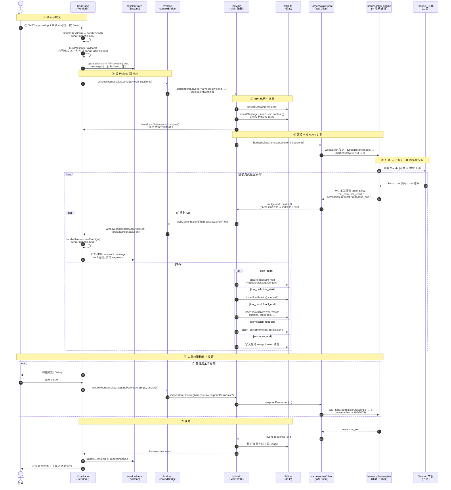

# 用户提问的系统工作时序

> 视角：用户在 Chat 页面输入框中键入一个问题并回车后，系统从前端到后端，再到 Agent 引擎之间发生的事情。
>
> 涉及的源码层： `renderer` (UI) → `preload` (Context Bridge) → `main` (Electron 主进程 + SQLite) → `harnessclaw-engine` (本地子进程, 通过 WebSocket 通信) → 上游 Claude / 工具调用 → 事件回流。

---

## 1. 参与者（Participants）

| 角色 | 物理位置 | 关键文件 |
|---|---|---|
| **User** | 桌面端 | — |
| **ChatPage** | Renderer 进程 | `src/renderer/src/components/pages/ChatPage.tsx` |
| **sessionStore** | Renderer (Zustand) | `src/renderer/src/stores/sessionStore.ts` |
| **PreloadBridge** | Preload (contextBridge) | `src/preload/index.ts` |
| **IPC Main** | Main 进程 IPC 层 | `src/main/index.ts` (`ipcMain.handle('harnessclaw:*')`) |
| **HarnessclawClient** | Main 进程 WS 客户端 | `src/main/harnessclaw.ts` |
| **SQLite (better-sqlite3)** | Main 进程 | `src/main/db.ts` |
| **harnessclaw-engine** | 本地子进程 (spawn) | `resources/bin/harnessclaw-engine` |
| **Upstream Claude / Tools** | 远程 / 本地工具 | 由 engine 内部调度 |

---

## 2. 高层时序图

---

## 3. 关键事件与数据库写入对照表

| 引擎事件 | UI 行为 | DB 写入 | 主要代码位置 |
|---|---|---|---|
| `connected` | 顶栏状态置为 connected | — | `ChatPage.tsx:2454` |
| `text_delta` | 追加流式文本到当前 assistant 段 | `insertMessage` (首块) + `updateMessageContent` | `index.ts:1512-1539` / `ChatPage.tsx:2574-2650` |
| `tool_call` / `tool_start` | 在消息上挂 tool 活动卡片 | `insertToolActivity(type='call')` | `index.ts:1426-1442` |
| `tool_result` / `tool_end` | 渲染工具结果、耗时、语言 | `insertToolActivity(type='result', duration, ...)` | `index.ts:1444-1466` |
| `permission_request` | 弹出 Dialog 等待用户决定 | `insertToolActivity(type='permission')` | `index.ts:1468-1488` |
| `subagent_event` | 嵌套渲染子 Agent 文本 / 工具 | 嵌套写入 | `index.ts:1293-1369` |
| `response` / `response_end` | 关闭 streaming，渲染 usage | 写 prompt / completion tokens | `index.ts:1541-1591` |

---

## 4. 设计要点（为什么是这样）

1. **三段式分层**：Renderer 完全只负责渲染与本地状态；所有持久化与对外通信都在 Main，符合 Electron 的安全边界（`contextIsolation` 打开，preload 仅暴露白名单 API）。
2. **WebSocket → 本地引擎**：`harnessclaw-engine` 作为独立子进程承载与 Claude / 工具的多轮调度，主进程只是「桥」。这样可以独立升级引擎，不动 Electron 外壳。
3. **同一事件双路径**：每条 engine 事件会同时被「广播给 UI」与「落到 SQLite」，UI 的实时性与历史会话回放都靠这同一份事件流；UI 离线/重启后再读 DB 即可重建时间线。
4. **权限是带外 RPC**：工具权限走单独的 `permission.response` 通道，不会阻塞主消息流，UI 只需异步把用户决定回送给引擎。

---

## 5. 文件索引（便于跳转）

- `src/renderer/src/components/pages/ChatPage.tsx:3387` — `handleSend()`
- `src/renderer/src/components/pages/ChatPage.tsx:2368` — `handleHarnessclawEvent()`
- `src/renderer/src/components/common/SkillComposerInput.tsx` — 输入组件
- `src/preload/index.ts:65-87` — `harnessclawAPI`（`send` / `onEvent` / `onStatus` / `respondPermission`）
- `src/main/index.ts:1647` — `ipcMain.handle('harnessclaw:send', ...)`
- `src/main/index.ts:1206` — engine 事件广播 + 落库分发
- `src/main/index.ts:608-643` — `startHarnessclawEngine()` 拉起子进程
- `src/main/harnessclaw.ts:793` — `HarnessclawClient.send()`
- `src/main/harnessclaw.ts:965` — `respondPermission()`
- `src/main/db.ts` — `upsertSession` / `insertMessage` / `insertToolActivity` / `updateMessageContent`
- `resources/bin/harnessclaw-engine` — 本地 Agent 引擎二进制
